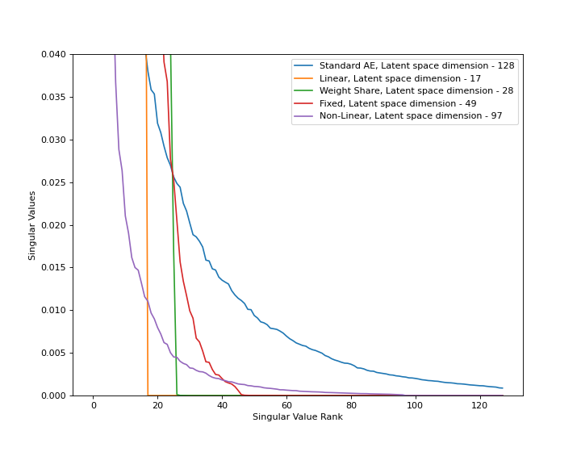
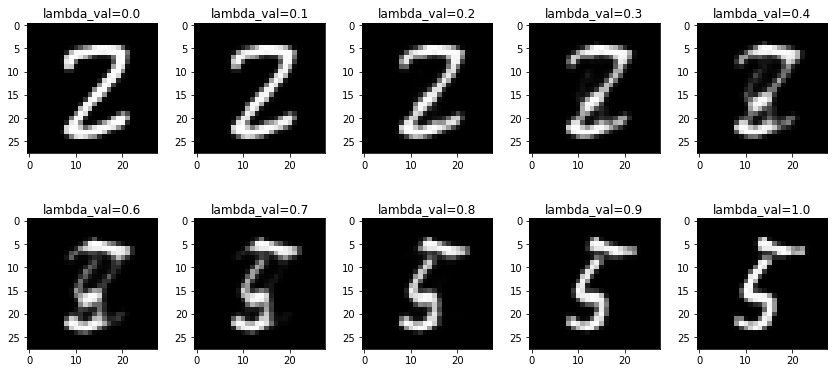
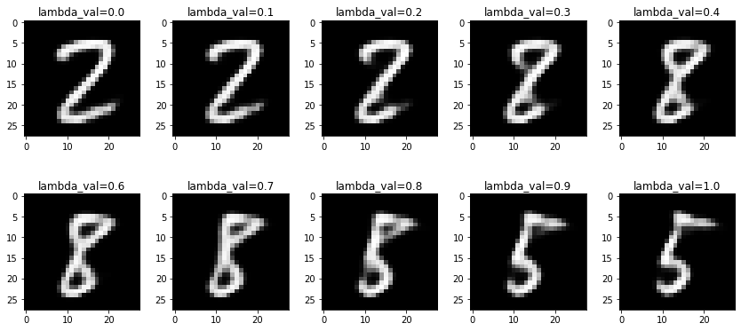

## Implicit Rank Minimization in Gradient Descent

Implementation of [Implicit Rank-Minimizing Autoencoder](https://arxiv.org/abs/2010.00679) by Li Jing, Jure Zbontar and Yann LeCun

This is the code accompanying the blog post https://dibyadas.github.io/posts/irmae

 Singular values vs rank of the latent space of different autoencoders 

 Interpolation in the latent space of standard AE 

 
 Interpolation in the latent space of linear IRMAE with l=8 
